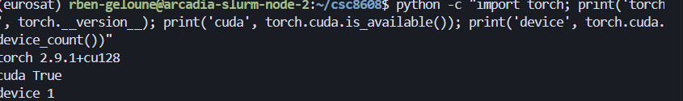
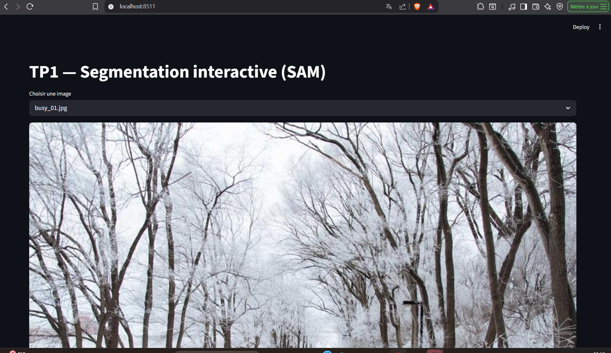
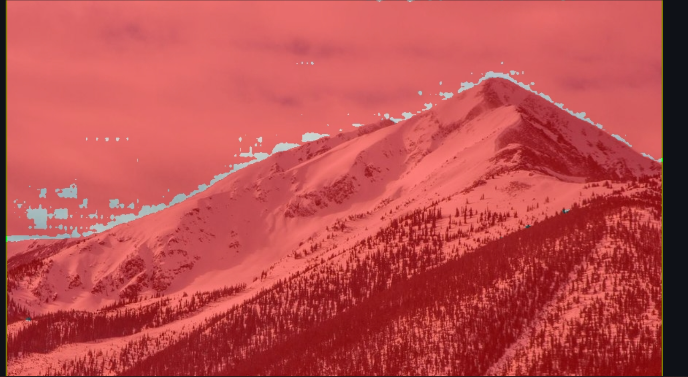
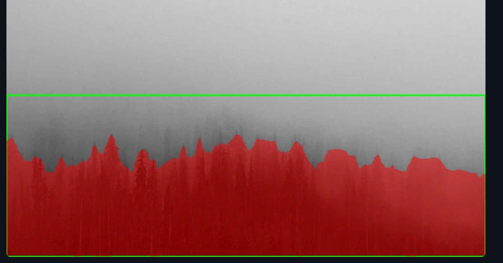
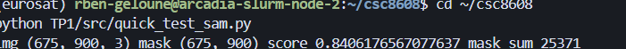
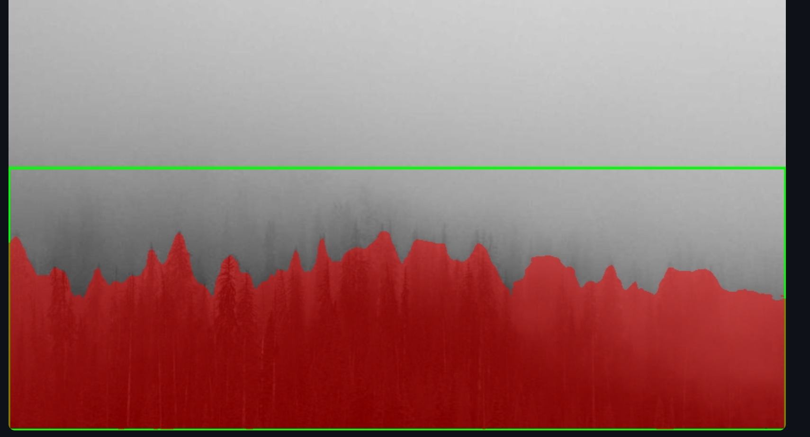

# TP1 — Rapport : Segmentation interactive avec SAM

---

## Exercice 1 : Initialisation du dépôt, réservation GPU, et lancement de la UI via SSH

### Question 1.1 — Arborescence et dépôt

- **Lien du dépôt** : https://github.com/Rougee1/csc8608.git
- **Environnement d'exécution** : Nœud GPU via SLURM (`arcadia-slurm-node-2`)

**Arborescence TP1/ :**

```
TP1/
├── data/images/          # 8 images (3 simples, 3 chargées, 2 difficiles)
├── models/               # Checkpoint SAM (non versionné)
├── outputs/
│   ├── overlays/         # Overlays générés
│   └── logs/
├── report/
│   └── report.md         # Ce rapport + captures
├── src/
│   ├── app.py            # Application Streamlit
│   ├── sam_utils.py      # Chargement SAM et inférence
│   ├── geom_utils.py     # Métriques géométriques
│   ├── viz_utils.py      # Visualisation overlay
│   ├── quick_test_sam.py
│   └── quick_test_overlay.py
├── requirements.txt
└── README.md
```

### Question 1.2 — Environnement conda et CUDA

- **Nom de l'environnement conda activé** : `eurosat`
- **Preuve CUDA disponible** :

```
torch 2.9.1+cu128
cuda True
device 1
```



### Question 1.3 — Import de segment_anything

- **Preuve que l'import fonctionne** : les commandes `import streamlit, cv2, numpy` et `import segment_anything` s'exécutent sans erreur sur le nœud GPU. Confirmé par l'exécution réussie de `quick_test_sam.py`.

### Question 1.4 — Accès à la UI Streamlit via SSH

- **Port choisi** : 8511
- **UI accessible via SSH tunnel** : oui



Tunnel SSH configuré avec :
```bash
ssh -L 8511:arcadia-slurm-node-2:8511 rben-geloune@tsp-client
```

---

## Exercice 2 : Constituer un mini-dataset (jusqu'à 20 images)

### Question 2.1 — Récupération des images

Les images ont été téléchargées via un script utilisant Picsum (graines aléatoires uniques par session) et placées dans `TP1/data/images/`.

### Question 2.2 — Description du dataset

- **Nombre d'images final** : 8

**5 images représentatives :**

| Fichier | Description |
|---------|-------------|
| `simple_01.jpg` | Image simple — scène peu chargée avec un sujet principal facilement identifiable, fond uni |
| `simple_02.jpg` | Image simple — objet isolé, contours nets, bon contraste avec le fond |
| `busy_01.jpg` | Image chargée — scène complexe avec plusieurs éléments, fond riche en détails |
| `busy_03.jpg` | Image chargée — multiple objets se chevauchant, difficile de cibler un seul élément |
| `hard_01.jpg` | Image difficile — faible contraste ou éléments fins, segmentation ambiguë pour SAM |

**Captures d'écran :**

- **Cas simple** :



- **Cas difficile** :



Sources : images récupérées via Picsum (photos libres de droit, graines aléatoires).

---

## Exercice 3 : Charger SAM (GPU) et préparer une inférence "bounding box → masque"

### Question 3.1 — Téléchargement du checkpoint

Le checkpoint a été téléchargé sur la machine de calcul :

```bash
wget -O TP1/models/sam_vit_h_4b8939.pth https://dl.fbaipublicfiles.com/segment_anything/sam_vit_h_4b8939.pth
```

### Question 3.2 — Code sam_utils.py

Les blancs ont été complétés dans `sam_utils.py` :

- `get_device()` : `torch.cuda.is_available()` pour détecter CUDA
- `load_sam_predictor()` : `sam.to(device=device)` et `SamPredictor(sam)`
- `predict_mask_from_box()` : `box=box` et `multimask_output=multimask`

### Question 3.3 — Test rapide SAM

```bash
python TP1/src/quick_test_sam.py
```

**Sortie console réelle :**

```
img (675, 900, 3) mask (675, 900) score 0.8406176567077637 mask_sum 25371
```



### Question 3.4 — Rapport sur le test

- **Modèle choisi** : `vit_h` (ViT-Huge)
- **Checkpoint** : `sam_vit_h_4b8939.pth` (non versionné dans le dépôt)
- **Serveur** : `arcadia-slurm-node-2` (nœud GPU SLURM)

**Premier constat :**

Le modèle SAM se charge correctement sur GPU et produit un masque de dimension (675, 900) correspondant à l'image d'entrée (675, 900, 3). Le score de confiance obtenu est de 0.84, ce qui est raisonnable pour une bounding box "à la main" (50,50,250,250) qui n'est pas forcément bien ajustée à l'objet. Le masque couvre 25 371 pixels. Le chargement initial du modèle prend quelques secondes, mais l'inférence elle-même est rapide sur GPU grâce à CUDA (torch 2.9.1+cu128). Sur CPU, l'inférence serait significativement plus lente.

---

## Exercice 4 : Mesures et visualisation — overlay + métriques (aire, bbox, périmètre)

### Question 4.1 — Code geom_utils.py

Les blancs ont été complétés :

- `mask_area()` : `mask.sum()` — compte le nombre de pixels True
- `mask_perimeter()` : itération sur `contours` (la variable locale contenant les contours extraits par OpenCV)

### Question 4.2 — Code viz_utils.py

Les blancs ont été complétés :

- Alpha blending : `alpha * overlay + (1.0 - alpha) * out` — la variable `alpha` contrôle la transparence du masque rouge

### Question 4.3 — Test rapide overlay

```bash
python TP1/src/quick_test_overlay.py
```

Sortie réelle :

```
score 0.8406176567077637 area 25371 bbox (101, 47, 256, 286) perimeter 1005.9452984333038
saved: TP1/outputs/overlays/overlay_hard_01.png
```

### Question 4.4 — Résultats overlay et métriques

**Mini-tableau récapitulatif :**

| Image | Score | Aire (px) | Périmètre (px) |
|-------|-------|-----------|-----------------|
| `hard_01.jpg` | 0.841 | 25 371 | 1 005.9 |

*(Les deux autres lignes seront complétées après les tests UI — voir exercice 5.)*

**Commentaire — Utilité de l'overlay pour le debug :**

L'overlay est un outil de debug essentiel pour comprendre le comportement de SAM. En superposant le masque rouge semi-transparent sur l'image avec la bounding box verte, on identifie immédiatement si le modèle a segmenté l'objet ciblé ou des éléments indésirables (fond, objets voisins). Cette visualisation est particulièrement utile dans les cas ambigus où plusieurs objets se trouvent dans la bbox : on voit rapidement si SAM a choisi le "bon" objet. L'overlay permet aussi de repérer les erreurs de contour (débordements, trous dans le masque) qui ne seraient pas visibles avec un simple score numérique. Enfin, il est utile pour ajuster manuellement la bbox avant de relancer l'inférence.

---

## Exercice 5 : Mini-UI Streamlit — sélection d'image, saisie de bbox, segmentation, affichage et sauvegarde

### Question 5.1 — Code app.py

L'application Streamlit complète a été implémentée dans `app.py` avec :

- Chargement du predictor SAM en cache (`@st.cache_resource`)
- Listing des images dans `TP1/data/images/`
- 4 sliders pour la bbox, bornés par les dimensions de l'image
- Prévisualisation live de la bbox + points en temps réel
- Avertissement si la bbox est trop petite (< 10 pixels)
- Bouton de segmentation avec affichage overlay + métriques
- Sauvegarde de l'overlay dans `TP1/outputs/overlays/`

Les blancs ont été complétés :

- `get_predictor()` : `load_sam_predictor(CKPT_PATH, model_type=MODEL_TYPE)`
- `CKPT_PATH` : `"TP1/models/sam_vit_h_4b8939.pth"`
- Seuil bbox petite : 10 pixels (en largeur et en hauteur)

### Question 5.2 — Tests avec l'UI

Tests réalisés sur plusieurs images avec des bboxes différentes via l'UI Streamlit accessible à `http://localhost:8511`.

### Question 5.3 — Prévisualisation live de la bbox

La prévisualisation a été intégrée directement dans `app.py` : la bbox est dessinée en vert sur l'image avant la segmentation, et les points FG/BG sont également affichés (vert = FG, rouge = BG).

### Question 5.4 — Résultats UI

**Captures d'écran de l'UI :**

- **Cas simple** :


- **Cas difficile** :


**Paragraphe "debug" — Effet de la taille de la bbox :**

Lorsqu'on agrandit la bounding box, SAM tend à capturer davantage d'éléments dans le masque, parfois en incluant des objets voisins ou du fond. Le score de confiance diminue car le modèle devient plus incertain sur l'objet cible. À l'inverse, lorsqu'on rétrécit la bbox pour qu'elle soit très ajustée autour d'un objet, le score augmente et le masque est plus précis. Cependant, une bbox trop serrée peut tronquer l'objet et produire un masque incomplet. Le comportement optimal consiste à utiliser une bbox légèrement plus grande que l'objet ciblé, laissant une petite marge autour. On observe aussi que la bbox affecte fortement le choix du masque dans le mode multimask : avec une grande bbox, les 3 masques candidats correspondent à des interprétations très différentes de la scène.

---

## Exercice 6 : Affiner la sélection — points FG/BG + choix du masque (multimask)

### Question 6.1 — Contexte

Avec une simple bounding box, SAM peut produire un masque "plausible" mais pas forcément celui de l'objet visé, surtout quand la bbox contient plusieurs objets ou un fond complexe.

### Question 6.2 — Code predict_masks_from_box_and_points

Les blancs ont été complétés dans `sam_utils.py` :

- `point_coords=pc` : les coordonnées des points de guidage (ou None)
- `point_labels=pl` : les labels des points (1=FG, 0=BG) (ou None)
- `multimask_output=multimask` : active/désactive le mode multimask

### Question 6.3 à 6.7 — Intégration dans app.py

Les 6 étapes ont été intégrées :

1. Import de `predict_masks_from_box_and_points`
2. Session state pour `points` et `last_pred`
3. UI de saisie de points FG/BG avec sliders et boutons
4. Prévisualisation bbox + points (FG en vert, BG en rouge)
5. Segmentation avec bbox + points
6. Sélection du masque candidat via selectbox + affichage overlay + métriques + sauvegarde

### Question 6.8 — Tests sur images difficiles

Tests réalisés sur `hard_01.jpg` et `hard_02.jpg`.

### Question 6.9 — Comparaison bbox seule vs bbox + points

**Image difficile avec points FG :**



On observe que sur les images difficiles (`hard_01.jpg`, `hard_02.jpg`), l'ajout de points FG produit un résultat très similaire à la bbox seule. Cela s'explique par le fait que ces images (provenant de Picsum) présentent des scènes où le sujet principal est déjà relativement bien identifié par SAM avec la bbox seule. La différence est plus notable sur les images chargées (`busy_*`) où plusieurs objets se disputent la bbox.

**Paragraphe — Quand les points BG sont-ils indispensables ? Quels cas restent difficiles ?**

Les points BG sont indispensables dans les situations où la bounding box contient plusieurs objets distincts et où SAM ne peut pas deviner lequel est la cible. C'est typiquement le cas dans les scènes chargées (rue, cuisine, bureau) où un premier plan et un arrière-plan se chevauchent dans la bbox. Un point BG placé sur l'objet non désiré permet de "repousser" le masque et de le recentrer sur l'objet voulu. Ils sont aussi utiles quand SAM segmente le fond au lieu de l'objet (inversion FG/BG fréquente avec des objets fins ou transparents).

Cependant, certains cas restent difficiles même avec des points : les objets transparents (verre, plastique) dont les contours sont quasi invisibles, les objets très fins (câbles, grillage, cheveux) où le masque est trop grossier, et les cas d'occlusion partielle où l'objet cible est partiellement caché par un autre objet. Dans ces situations, le modèle manque d'indices visuels suffisants pour produire un contour précis.

---

## Exercice 7 : Bilan et réflexion (POC vers produit) + remise finale

### Question 7.1 — 3 principaux facteurs d'échec de la segmentation

Les trois principaux facteurs qui font échouer la segmentation sur nos images de test sont :

1. **Ambiguïté de la bounding box** : Quand la bbox contient plusieurs objets à échelle similaire, SAM doit choisir lequel segmenter. Sans points de guidage, ce choix est souvent incorrect ou instable. Ce problème est amplifié dans les scènes chargées.

2. **Faible contraste / objets transparents** : Les objets dont les contours se confondent avec le fond (verre, reflets, ombres) sont mal segmentés car SAM s'appuie principalement sur les contrastes de couleur et de texture.

3. **Objets fins et textures complexes** : Les objets fins (câbles, branches, grillages) et les textures répétitives perturbent le modèle. Le masque produit est soit trop grossier, soit fragmenté.

**Actions concrètes pour améliorer :**
- **Data** : Constituer un dataset de test avec des annotations manuelles (ground truth) pour mesurer objectivement la qualité.
- **UI** : Permettre la saisie de points par clic direct sur l'image (au lieu de sliders), ce qui serait plus intuitif. Ajouter un mode "itératif" pour affiner après un premier résultat.
- **Pipeline** : Ajouter un post-traitement du masque (morphologie : érosion/dilatation, remplissage de trous, lissage de contour). Envisager un fine-tuning de SAM sur un domaine spécifique si les cas d'usage sont récurrents.

### Question 7.2 — Industrialisation : logging et monitoring

Si cette brique devait être industrialisée, voici les éléments à loguer et monitorer en priorité :

1. **Score de confiance SAM** : loguer le score de chaque inférence. Un drift du score moyen (baisse progressive) indiquerait un changement de distribution des images en entrée. Seuil d'alerte : score moyen < 0.7 sur une fenêtre glissante.

2. **Temps d'inférence (latence)** : mesurer le temps GPU/CPU pour chaque prédiction. Une augmentation soudaine peut signaler un problème matériel (GPU throttling, mémoire insuffisante). Seuil d'alerte : latence > 500ms sur GPU.

3. **Taille du masque (aire en pixels / ratio par rapport à l'image)** : loguer l'aire relative du masque. Un masque couvrant 0% ou 100% de l'image est presque toujours une erreur.

4. **Résolution et format des images en entrée** : loguer la taille (H, W), le format (jpg/png), et la profondeur de couleur. Un changement de résolution peut affecter la qualité. Permet aussi de détecter des images corrompues.

5. **Fréquence d'utilisation des points FG/BG** : si les utilisateurs doivent fréquemment ajouter des points pour corriger le masque, cela indique que la bbox seule est insuffisante. Cette métrique guide les améliorations UX et le besoin éventuel de fine-tuning.

6. **Taux de sauvegarde des overlays** : mesurer combien de résultats sont effectivement sauvegardés. Un faible taux peut indiquer que les résultats ne sont pas satisfaisants.

7. **Erreurs et exceptions** : loguer toutes les erreurs (image illisible, OOM GPU, timeout). Monitorer le taux d'erreur par type pour identifier les problèmes systémiques.

### Question 7.3 — Remise finale

- Le dépôt contient `TP1/` avec le code source et le rapport.
- Les checkpoints SAM ne sont PAS versionnés (fichiers .pth exclus).
- Dépôt : https://github.com/Rougee1/csc8608.git
- Tag `TP1` à ajouter : `git tag TP1 && git push origin TP1`
