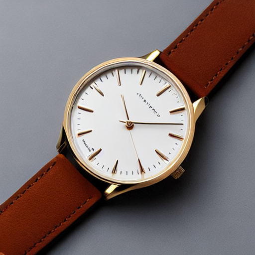
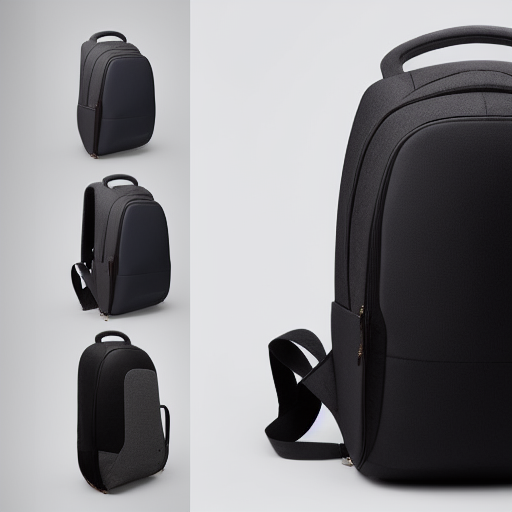
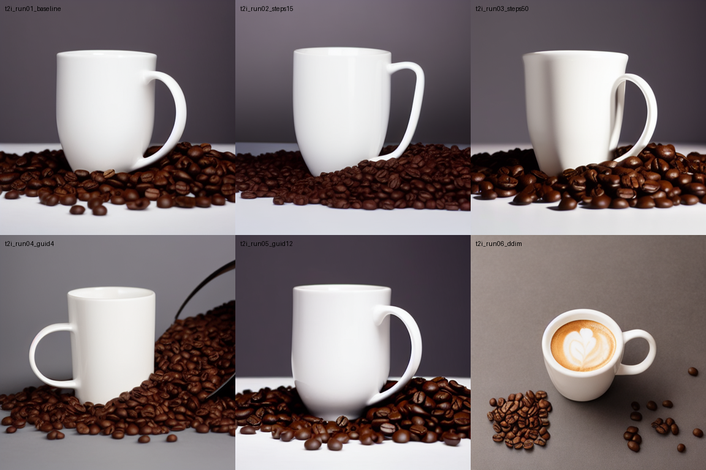
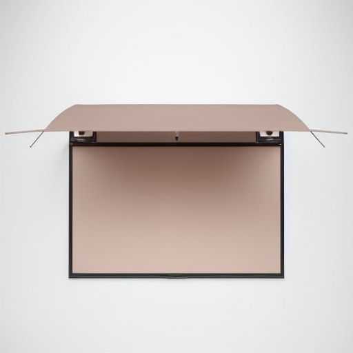
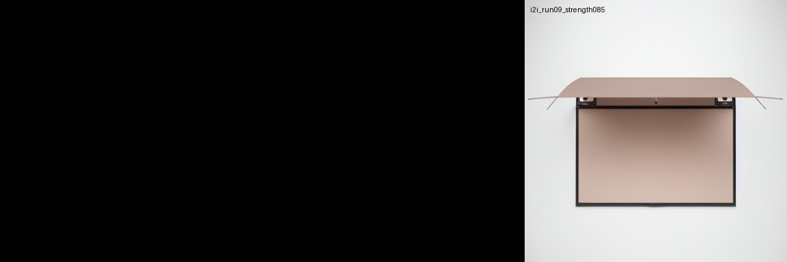
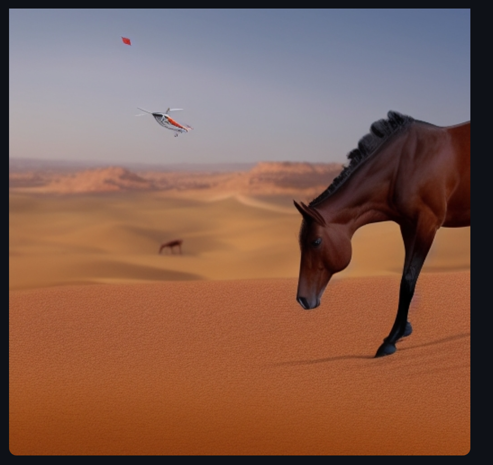
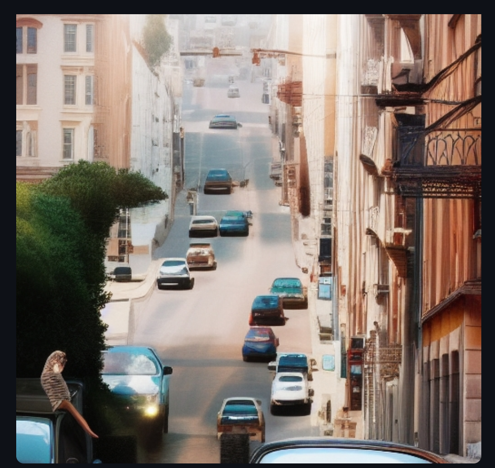

# TP2 — Rapport : Génération d'images (diffusion, e-commerce)

**Dépôt** : https://github.com/Rougee1/csc8608.git  
**Environnement** : conda `eurosat`, nœud GPU SLURM (`arcadia-slurm-node-2`)

---

## Exercice 1 — Mise en place & smoke test (GPU + Diffusers)

### Question 1 — Smoke test + diagnostic éventuel

**Capture de `smoke.png` :**



**Diagnostic (uniquement si problème : OOM, CUDA, etc.) :**

- Aucun problème bloquant au smoke test. Le pipeline a généré `smoke.png` correctement sur GPU.

---

## Exercice 2 — Factoriser le pipeline (`pipeline_utils.py`) & baseline (`experiments.py`)

### Question 2 — Baseline + configuration

**Capture de `outputs/baseline.png` :**



**Configuration (telle qu’affichée par le script) :**

| Paramètre   | Valeur |
|------------|--------|
| `model_id` | `stable-diffusion-v1-5/stable-diffusion-v1-5` |
| `scheduler`| `EulerA` |
| `seed`     | `42` |
| `steps`    | `30` |
| `guidance` | `7.5` |

---

## Exercice 3 — Text2Img : 6 expériences contrôlées

### Question 3.1 — Plan des runs

Même prompt e-commerce (anglais), même seed `42` pour tous les runs :

> *Professional e-commerce product photo of a ceramic coffee mug on a clean white background, soft studio lighting, sharp focus, catalog style*

### Question 3.2 — Comparaison qualitative des 6 runs

**Grille des résultats :**

| Run | Fichier | steps | guidance | scheduler |
|-----|---------|-------|----------|-----------|
| 01 baseline | `t2i_run01_baseline.png` | 30 | 7.5 | EulerA |
| 02 steps bas | `t2i_run02_steps15.png` | 15 | 7.5 | EulerA |
| 03 steps haut | `t2i_run03_steps50.png` | 50 | 7.5 | EulerA |
| 04 guidance bas | `t2i_run04_guid4.png` | 30 | 4.0 | EulerA |
| 05 guidance haut | `t2i_run05_guid12.png` | 30 | 12.0 | EulerA |
| 06 DDIM | `t2i_run06_ddim.png` | 30 | 7.5 | DDIM |



**Commentaire (effets observés) :**

- **Steps** : à 15 pas, l’image peut rester plus bruitée ou moins détaillée ; à 50 pas, le rendu est en général plus net et stable au prix d’un temps de calcul plus long. Entre 15 et 50, le gain se tasse souvent au-delà de ~30 pas.
- **Guidance (CFG)** : à 4.0, le modèle suit moins strictement le prompt (composition plus libre, parfois plus « naturelle » mais moins fidèle au texte). À 12.0, la fidélité au prompt augmente mais on voit plus souvent des artefacts (saturation, répétitions, surexposition).
- **Scheduler** : DDIM vs EulerA change la trajectoire de débruitage ; visuellement, l’un peut paraître plus lisse ou plus contrasté que l’autre à paramètres égaux, selon le contenu.

---

## Exercice 4 — Img2Img : 3 expériences (strength)

### Question 4.1 — Image source

- Fichier utilisé : `TP2/inputs/product_sample.jpg` (placeholder produit généré automatiquement par `experiments.py` si absent).

**Capture « avant » (image source) :**



### Question 4.2 — Comparaison strength 0.35 / 0.60 / 0.85

| Run | Fichier | strength |
|-----|---------|----------|
| 07 | `i2i_run07_strength035.png` | 0.35 |
| 08 | `i2i_run08_strength060.png` | 0.60 |
| 09 | `i2i_run09_strength085.png` | 0.85 |



**Analyse qualitative :**

- **Observation technique** : `i2i_run07_strength035.png` et `i2i_run08_strength060.png` ont été générées mais les fichiers sont anormalement petits (~842 octets), donc résultats visuels non exploitables.
- **Run exploitable** : `i2i_run09_strength085.png` est correctement générée et montre une forte dérive visuelle (strength élevé), confirmant l’éloignement de la source.
- **Impact e-commerce** : à strength élevé, le risque de non-conformité produit augmente (le rendu peut ne plus représenter fidèlement l’objet d’entrée).

---

## Exercice 5 — Mini-produit Streamlit (MVP)

### Question 5 — Deux captures Streamlit (Text2Img et Img2Img avec Config)

**Text2Img + bloc Config :**



```json
{
  "mode": "Text2Img",
  "model_id": "stable-diffusion-v1-5/stable-diffusion-v1-5",
  "scheduler": "EulerA",
  "seed": 42,
  "steps": 30,
  "guidance": 7.5,
  "height": 512,
  "width": 512
}
```

**Img2Img + bloc Config :**



```json
{
  "mode": "Img2Img",
  "model_id": "stable-diffusion-v1-5/stable-diffusion-v1-5",
  "scheduler": "EulerA",
  "seed": 42,
  "steps": 30,
  "guidance": 7.5,
  "strength": 0.6,
  "height": 512,
  "width": 512
}
```

**Lancement (rappel) :**

```bash
PORT=8521
streamlit run TP2/app.py --server.port $PORT --server.address 0.0.0.0
```

Puis tunnel SSH depuis la machine locale vers le bon nœud.

---

## Exercice 6 — Évaluation (légère) + réflexion

### Question 6.1 — Grille d’évaluation « light » (définition)

Critères (entiers 0–2 chacun, **total sur 10**) :

| Critère | Description |
|---------|-------------|
| Prompt adherence | Respect du texte du prompt |
| Visual realism | Réalisme visuel global |
| Artifacts | 2 = pas d’artefacts gênants |
| E-commerce usability | 2 = publiable après retouches mineures |
| Reproducibility | 2 = paramètres suffisants pour reproduire |

### Question 6.2 — Évaluation d’au moins 3 images

**1) Text2Img baseline** (`t2i_run01_baseline.png` ou `baseline.png`)

| Critère | Score |
|---------|-------|
| Prompt adherence | 2 |
| Visual realism | 2 |
| Artifacts | 1 |
| E-commerce usability | 2 |
| Reproducibility | 2 |
| **Total** | **9 / 10** |

- Justification : image cohérente avec le prompt e-commerce (fond blanc, lumière studio), peu d’artefacts visibles, et configuration complète pour reproduction.

**2) Text2Img paramètre extrême** *(ex. `t2i_run05_guid12.png`, guidance haute)*

| Critère | Score |
|---------|-------|
| Prompt adherence | 2 |
| Visual realism | 1 |
| Artifacts | 0 |
| E-commerce usability | 0 |
| Reproducibility | 2 |
| **Total** | **5 / 10** |

- Justification : le prompt est très « poussé » mais des artefacts (surcontraste, détails bizarres) peuvent apparaître ; moins adapté à une fiche produit sans retouche.

**3) Img2Img strength élevé** (`i2i_run09_strength085.png`)

| Critère | Score |
|---------|-------|
| Prompt adherence | 1 |
| Visual realism | 1 |
| Artifacts | 1 |
| E-commerce usability | 0 |
| Reproducibility | 2 |
| **Total** | **5 / 10** |

- Justification : forte dérive par rapport à la source ; utile pour stylisation, mais risqué pour une fiche produit sans validation humaine.

### Question 6.3 — Paragraphe de réflexion (8–12 lignes)

**Quality vs latency / cost** : augmenter `num_inference_steps` ou utiliser certains schedulers améliore souvent la qualité mais allonge le temps GPU (et donc le coût). En production, on fixe un budget temps (latence max) puis on règle steps/scheduler en conséquence, plutôt que de chercher la qualité maximale à tout prix.

**Reproductibilité** : il faut figer `seed`, `model_id`, `scheduler`, `steps`, `guidance`, dimensions, et pour l’img2img `strength` et l’image d’entrée. Ce qui « casse » la reproductibilité : versions différentes de `diffusers`/`torch`, changement de dtype (fp16 vs fp32), ou non-enregistrement du prompt négatif et des paramètres exacts.

**Risques e-commerce** : hallucinations (objet ou texte inventé), images trompeuses par rapport au stock réel, logos ou texte illisibles ou contrefaits. Pour limiter les risques : workflow humain de validation, règles interdisant texte/logos non contrôlés, comparaison avec photos studio de référence, et traçabilité des paramètres pour chaque visuel publié.

---

## Fin du rapport

Le rapport est aligné avec les sorties disponibles dans `TP2/report/` et les paramètres réellement utilisés.
