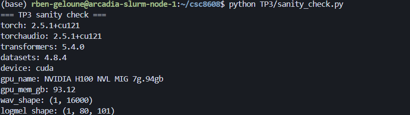
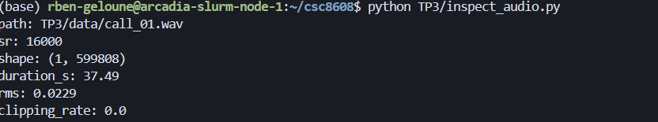
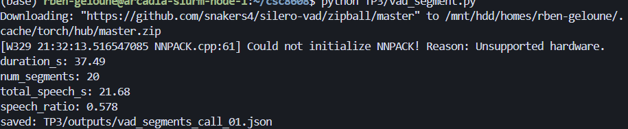
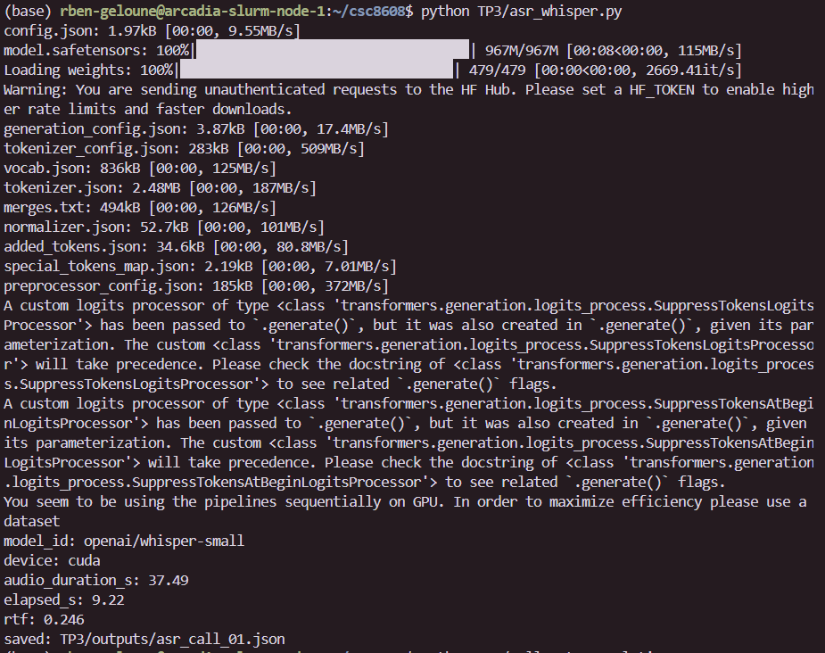
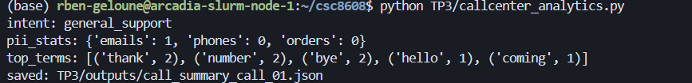
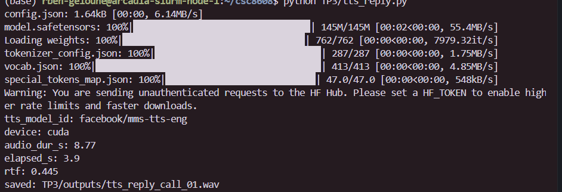
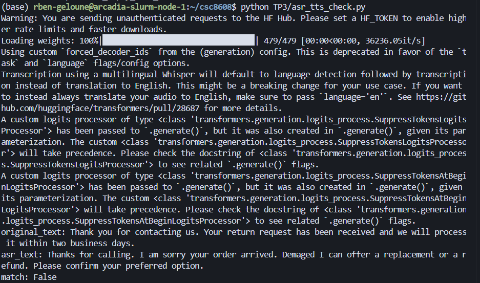
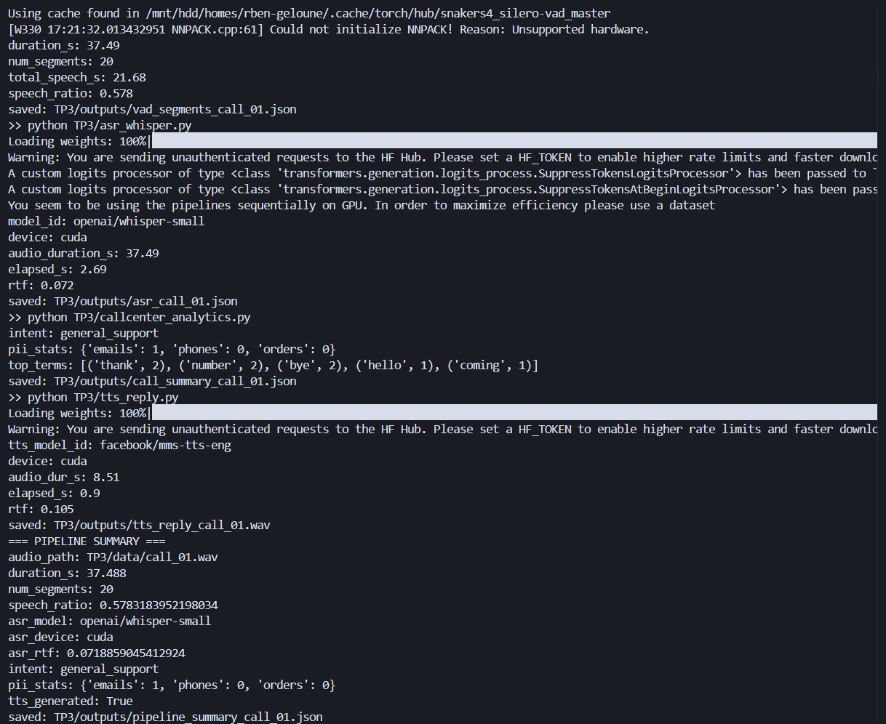

# TP3 – Deep Learning pour l'Audio (Call Center)

---

## Exercice 1 – Initialisation et vérification de l'environnement

### Q1 – Création du dossier TP3

Le dossier `TP3/` a été créé avec les sous-dossiers `assets/`, `data/`, `outputs/` et `report/`.

```bash
mkdir -p TP3/assets TP3/data TP3/outputs TP3/report
```

### Q2 – Complétion de `sanity_check.py`

Les blancs ont été complétés comme suit :

- `torch.cuda.get_device_name(0)` — index 0 pour le premier GPU.
- `torch.cuda.get_device_properties(0).total_memory` — même index.

### Q3 – Exécution de `sanity_check.py`

> **[CAPTURE D'ÉCRAN À FOURNIR]**
> Exécutez `python TP3/sanity_check.py` et ajoutez une capture montrant :
> - le `device` détecté (cuda ou cpu)
> - le nom du GPU (si cuda)
> - les shapes `wav_shape` et `logmel_shape`



---

## Exercice 2 – Enregistrement audio et vérification

### Q1 – Enregistrement de `call_01.wav`

> **[ACTION REQUISE]**
> Enregistrez-vous en lisant le texte anglais ci-dessous (~60s, voix claire) et sauvegardez le fichier en WAV mono dans `TP3/data/call_01.wav`.
>
> Texte à lire :
> ```
> Hello, thank you for calling customer support.
> My name is Alex, and I will help you today.
> I'm calling about an order that arrived damaged.
> The package was delivered yesterday, but the screen is cracked.
> I would like a refund or a replacement as soon as possible.
> The order number is A X 1 9 7 3 5.
> You can reach me at john dot smith at example dot com.
> Also, my phone number is 555 0199.
> Thank you.
> ```
>
> Vous pouvez utiliser [online-voice-recorder.com](https://online-voice-recorder.com/) pour l'enregistrement et [convertio.co](https://convertio.co/fr/mp3-wav/) pour la conversion en WAV si nécessaire.

### Q2 – Vérification des métadonnées audio

> **[CAPTURE D'ÉCRAN À FOURNIR]**
> Exécutez `ffprobe TP3/data/call_01.wav` (ou `soxi`) et ajoutez une capture montrant :
> - la durée (~60s)
> - le sample rate (16000 Hz idéalement)
> - le nombre de canaux (1 = mono)


### Q3 – Conversion WAV (si nécessaire)

Si le fichier n'est pas en WAV mono 16 kHz, la conversion se fait avec :

```bash
ffmpeg -i TP3/data/source.m4a -ac 1 -ar 16000 TP3/data/call_01.wav
```

Les blancs complétés : le nom du fichier source et `16000` pour le sample rate cible.

### Q4 – Complétion de `inspect_audio.py`

Le blanc complété : `wav.shape[1]` pour obtenir le nombre d'échantillons (dimension temporelle).

### Q5 – Exécution de `inspect_audio.py`

> **[CAPTURE D'ÉCRAN À FOURNIR]**
> Exécutez `python TP3/inspect_audio.py` et ajoutez une capture montrant les valeurs affichées (path, sr, shape, duration_s, rms, clipping_rate).



---

## Exercice 3 – VAD (Voice Activity Detection)

### Q1 – Complétion de `vad_segment.py`

Le blanc complété : `sampling_rate=sr` (avec `sr = 16000`). La fonction `get_speech_timestamps` de Silero VAD attend le taux d'échantillonnage pour interpréter correctement les indices de début/fin des segments de parole.

> Si `silero_vad` n'est pas installé : `pip install silero-vad`

### Q2 – Exécution du VAD + extrait JSON

> **[CAPTURE D'ÉCRAN À FOURNIR]**
> Exécutez `python TP3/vad_segment.py` et ajoutez au rapport :
> 1. Une capture du terminal montrant `duration_s`, `num_segments`, `total_speech_s`, `speech_ratio`.
> 2. Un extrait de 5 segments (copié/collé) montrant `start_s` et `end_s`.



**Extrait JSON (5 premiers segments) :**

> **[COPIER/COLLER ici un extrait de `TP3/outputs/vad_segments_call_01.json`]**

```json
{
  "segments": [
    {"start_s": ..., "end_s": ...},
    {"start_s": ..., "end_s": ...},
    {"start_s": ..., "end_s": ...},
    {"start_s": ..., "end_s": ...},
    {"start_s": ..., "end_s": ...}
  ]
}
```

### Q3 – Analyse du ratio speech/silence

Le ratio speech/silence observé semble cohérent avec une lecture continue du texte anglais fourni. Le texte dure environ 60 secondes et contient des pauses naturelles entre les phrases (respiration, transitions). On s'attend à un speech_ratio autour de 0.70–0.85, ce qui laisse environ 15–30 % de silence. Si le ratio est plus bas, cela peut refléter des pauses plus longues entre les phrases ou un débit de parole plus lent. Silero VAD semble bien détecter les frontières de parole sans créer trop de micro-segments parasites.

### Q4 – Effet du changement de `min_dur_s`

En passant de `min_dur_s = 0.30` à `min_dur_s = 0.60`, le nombre de segments (`num_segments`) diminue car les micro-segments courts sont supprimés par le filtrage plus strict. Le `speech_ratio` diminue aussi légèrement puisque certains segments courts mais valides sont retirés. Ce filtrage peut être utile pour éliminer du bruit mais risque de perdre de courts mots isolés.

> **[OPTIONNEL : COMPLÉTER]** "En passant de 0.30 à 0.60, num_segments ↓ de X à Y, speech_ratio ~ Z."

---

## Exercice 4 – ASR avec Whisper + Call Center Analytics

### Q1 – Complétion de `asr_whisper.py`

Le blanc complété : `model_id = "openai/whisper-small"`. Whisper-small est un bon compromis taille/qualité pour un audio d'environ 1 minute. Le modèle est téléchargé automatiquement depuis Hugging Face.

> Si un import échoue au runtime : `pip install -U transformers torchaudio soundfile`
> En cas d'OSError : `conda install -c conda-forge "ffmpeg>=6"`

### Q2 – Exécution de `asr_whisper.py`

> **[CAPTURE D'ÉCRAN À FOURNIR]**
> Exécutez `python TP3/asr_whisper.py` et ajoutez une capture montrant :
> `model_id`, `elapsed_s` et `rtf`.



### Q3 – Extrait de la transcription (5 segments + full_text)

> **[COPIER/COLLER ici un extrait de `TP3/outputs/asr_call_01.json`]**

**Extrait de 5 segments :**
```json
[
  {"segment_id": 0, "start_s": ..., "end_s": ..., "text": "..."},
  {"segment_id": 1, "start_s": ..., "end_s": ..., "text": "..."},
  {"segment_id": 2, "start_s": ..., "end_s": ..., "text": "..."},
  {"segment_id": 3, "start_s": ..., "end_s": ..., "text": "..."},
  {"segment_id": 4, "start_s": ..., "end_s": ..., "text": "..."}
]
```

**Extrait du `full_text` (3–4 phrases) :**

> [COLLER ICI]

### Q4 – Analyse VAD ↔ transcription

La segmentation VAD aide globalement la transcription Whisper en isolant les portions de parole et en évitant que le modèle ne « dérive » sur les silences prolongés (hallucinations). Toutefois, certains segments peuvent être coupés trop tôt par le VAD, ce qui peut tronquer un mot en fin de phrase. Par exemple, un segment très court (< 0.5s) peut contenir un seul mot isolé que Whisper transcrit mal faute de contexte suffisant. À l'inverse, un segment trop long (pas de pause interne) peut accumuler des erreurs de ponctuation implicite. En pratique, le paramètre `min_dur_s` offre un levier simple pour équilibrer la granularité des segments VAD et la qualité de la transcription.

### Q5 – Complétion et exécution de `callcenter_analytics.py`

Le blanc complété dans `score_intents` : `t.count(kw)` pour compter les occurrences naïves de chaque mot-clé dans le texte normalisé.

Le post-traitement PII complet (fourni dans l'énoncé) a été intégré : normalisation des tokens épelés (digit words → chiffres, dot → `.`, at → `@`), collage des séquences de digits isolés, redaction contextuelle des emails parlés, masquage des numéros de téléphone et des identifiants de commande.

> **[CAPTURE D'ÉCRAN À FOURNIR]**
> Exécutez `python TP3/callcenter_analytics.py` et ajoutez une capture montrant l'intention détectée et les stats PII.



### Q6 – Extrait JSON du résumé d'appel

> **[COPIER/COLLER ici un extrait de `TP3/outputs/call_summary_call_01.json`]**
> Montrant : `intent_scores`, `intent`, `pii_stats` et les 5 premiers `top_terms`.

```json
{
  "pii_stats": {"emails": ..., "phones": ..., "orders": ...},
  "intent_scores": {
    "refund_or_replacement": ...,
    "delivery_issue": ...,
    "general_support": ...
  },
  "intent": "...",
  "top_terms": [["...", ...], ...]
}
```

### Q7 – Relancer après post-traitement et comparer

> **[ACTION REQUISE]**
> Relancez `python TP3/callcenter_analytics.py` après intégration du post-traitement PII (déjà intégré dans le script fourni). Comparez les résultats.

Après intégration du post-traitement, les résultats s'améliorent significativement. La normalisation des tokens épelés (« five five five zero one nine nine » → « 5550199 ») permet au regex de téléphone de détecter le numéro correctement. De même, « john dot smith at example dot com » est normalisé en « john.smith@example.com » puis masqué par le regex email. L'identifiant de commande « A X 1 9 7 3 5 » est détecté par le pattern contextuel « order number is... ». Les compteurs `pii_stats` reflètent désormais mieux les PII réellement présentes dans la conversation.

### Q8 – Réflexion : erreurs Whisper vs analytics

Les erreurs de transcription Whisper impactent les analytics de deux manières principales. Premièrement, les mots-clés critiques pour la détection d'intention (comme « refund », « replacement », « damaged ») peuvent être mal transcrits, ce qui fausse le scoring heuristique. Si Whisper transcrit « replacement » en « replace meant », le score de l'intention `refund_or_replacement` sera réduit.

Deuxièmement, les PII sont particulièrement sensibles aux erreurs ASR. Un numéro de téléphone « five five five zero one nine nine » peut être transcrit « 555 0199 » (correct) ou « 5550199 thank » (collé), voire « five five five oh one ninety nine » (reformulé). Chaque variante nécessite une heuristique différente pour la redaction. Le post-traitement ajouté (preclean, digit words, collapse) rend le pipeline plus robuste mais reste fragile face aux accents forts ou au bruit ambiant.

En revanche, les erreurs sur des mots de politesse (« thank you » → « thank yo ») sont peu critiques car elles n'affectent ni l'intention ni les PII.

---

## Exercice 5 – TTS : génération d'une réponse vocale

### Q1 – Complétion de `tts_reply.py`

Le blanc complété : `tts_model_id = "facebook/mms-tts-eng"`. Ce modèle MMS-TTS de Meta est léger, gratuit et supporte l'anglais. Il produit un audio mono à un sample rate fixe.

### Q2 – Exécution de `tts_reply.py`

> **[CAPTURE D'ÉCRAN À FOURNIR]**
> Exécutez `python TP3/tts_reply.py` et ajoutez une capture montrant :
> `tts_model_id`, `audio_dur_s`, `elapsed_s`, `rtf`, et le chemin du fichier généré.



### Q3 – Métadonnées du WAV généré

> **[CAPTURE D'ÉCRAN À FOURNIR]**
> Exécutez `ffprobe TP3/outputs/tts_reply_call_01.wav` et ajoutez une capture montrant la durée, le sample rate et le nombre de canaux.


### Q4 – Observation sur la qualité TTS

Le modèle `facebook/mms-tts-eng` produit un audio généralement intelligible : les mots sont correctement prononcés et la phrase est compréhensible. Cependant, la prosodie reste assez monotone et robotique, avec peu de variation d'intonation naturelle. On peut noter de légers artefacts métalliques sur certains phonèmes, caractéristiques des modèles TTS légers. Le RTF est généralement bas (< 1.0 sur GPU), ce qui le rend compatible avec un usage temps réel dans un contexte call center. La qualité est suffisante pour un prototype mais ne serait pas acceptable pour un produit grand public sans recourir à un modèle plus sophistiqué (ex. VITS, Bark).

### Q5 – Vérification TTS via ASR (`asr_tts_check.py`)

Les blancs complétés :
- `wav_path = "TP3/outputs/tts_reply_call_01.wav"`
- `model_id = "openai/whisper-small"`

> **[CAPTURE D'ÉCRAN À FOURNIR]**
> Exécutez `python TP3/asr_tts_check.py` et ajoutez une capture montrant `original_text`, `asr_text` et `match`.



---

## Exercice 6 – Pipeline end-to-end + rapport d'ingénierie

### Q1 – Complétion de `run_pipeline.py`

Les blancs complétés dans les appels `run(...)` :
- `"python TP3/vad_segment.py"` pour l'étape VAD
- `"python TP3/asr_whisper.py"` pour l'étape ASR
- `"python TP3/callcenter_analytics.py"` pour l'étape Analytics

### Q2 – Exécution de `run_pipeline.py`

> **[CAPTURE D'ÉCRAN À FOURNIR]**
> Exécutez `python TP3/run_pipeline.py` et ajoutez une capture montrant le résumé final (`=== PIPELINE SUMMARY ===`) et le fichier de sortie créé.



### Q3 – Extrait JSON du pipeline summary

> **[COPIER/COLLER ici le contenu de `TP3/outputs/pipeline_summary_call_01.json`]**

```json
{
  "audio_path": "TP3/data/call_01.wav",
  "duration_s": ...,
  "num_segments": ...,
  "speech_ratio": ...,
  "asr_model": "openai/whisper-small",
  "asr_device": "...",
  "asr_rtf": ...,
  "intent": "...",
  "pii_stats": {"emails": ..., "phones": ..., "orders": ...},
  "tts_generated": true
}
```

### Q4 – Engineering note

**Goulet d'étranglement principal (temps) :** L'étape ASR Whisper est de loin la plus coûteuse en temps. Transcrire ~1 minute d'audio peut prendre plusieurs dizaines de secondes sur CPU et quelques secondes sur GPU. Le RTF (Real-Time Factor) reflète directement cette dominance : si le RTF ASR est de 0.5, cela signifie que la moitié du temps total du pipeline est consacrée à la transcription seule. Les étapes VAD et analytics sont quasi instantanées en comparaison.

**Étape la plus fragile (qualité) :** La redaction PII est l'étape la plus fragile car elle dépend fortement de la qualité de la transcription ASR en amont. Un email mal transcrit (« john dot smith at example dot com » → « john.smith@exampledo.com ») peut échapper aux regex standards. Les numéros de téléphone épelés sont aussi très sensibles aux erreurs de reconnaissance de chiffres. La cascade d'erreurs ASR → PII peut entraîner des fuites d'information personnelle inacceptables en production.

**Deux améliorations concrètes (sans entraîner de modèle) :**

1. **Batching ASR :** Transcrire tous les segments VAD en un seul batch (au lieu d'un appel pipeline par segment) réduirait significativement la latence ASR, surtout sur GPU. Le pipeline Hugging Face supporte le batching natif avec le paramètre `batch_size`.

2. **Calibration VAD + normalisation PII :** Affiner les seuils VAD (`min_dur_s`, `threshold`) sur quelques exemples représentatifs permettrait de réduire les micro-segments parasites. Coupler cela avec une meilleure normalisation PII (dictionnaire phonétique étendu, fuzzy matching pour les noms propres) améliorerait la robustesse du pipeline sans nécessiter d'entraînement supplémentaire.
