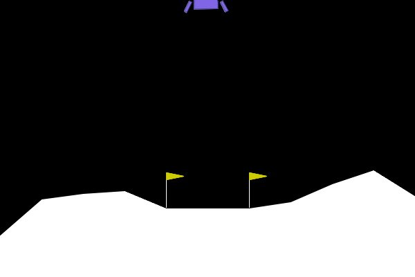
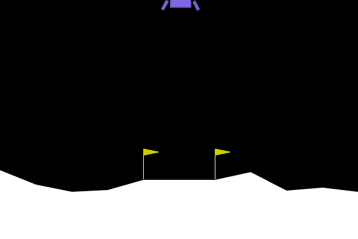
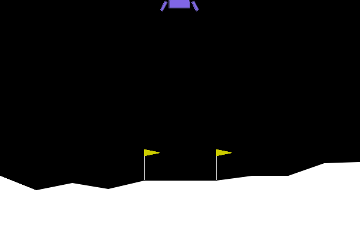
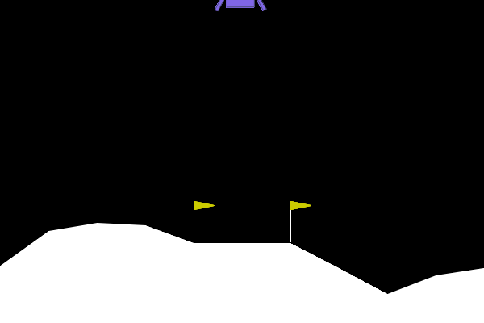

# TP5 – Deep Reinforcement Learning (LunarLander-v3)

---

## Exercice 1 – Comprendre la Matrice et Instrumenter l'Environnement

### Q1 – Complétion de `random_agent.py`

Blancs complétés :
- `render_mode="rgb_array"` — mode de rendu qui retourne des matrices de pixels (numpy arrays) au lieu d'ouvrir une fenêtre graphique.
- `env.action_space.sample()` — échantillonne une action aléatoire dans l'espace d'actions discret {0: Rien, 1: Gauche, 2: Principal, 3: Droite}.
- `env.step(action)` — applique l'action choisie à l'environnement et retourne l'observation suivante, la récompense, et les flags de terminaison.
- `total_reward += reward` — accumulation de la récompense pour le score total de l'épisode.
- `env.render()` — retourne l'image courante sous forme de matrice RGB (car `render_mode="rgb_array"`).

### Q2 – Exécution de l'agent aléatoire

> **Capture d'écran** : voir `report/random_agent.png`



```
Espace d'observation (Capteurs) : Box([-2.5, -2.5, -10., -10., -6.2831855, -10.,
  -0., -0.], [2.5, 2.5, 10., 10., 6.2831855, 10.,
  1., 1.], (8,), float32)
Espace d'action (Moteurs) : Discrete(4)

--- RAPPORT DE VOL ---
Issue du vol : CRASH DÉTECTÉ
Récompense totale cumulée : -265.95 points
Allumages moteur principal : 25
Allumages moteurs latéraux : 39
Durée du vol : 83 frames
Vidéo de la télémétrie sauvegardée sous 'TP5/random_agent.gif'
```

L'agent aléatoire obtient un score de **-265.95 points** et crash systématiquement. Le seuil de résolution est de **+200 points** : l'agent aléatoire en est à **~466 points de distance**. Le vaisseau dérive sans contrôle, allumant les moteurs de manière incohérente (25 allumages moteur principal, 39 latéraux en seulement 83 frames), gaspillant du carburant et finissant par crasher après un vol très court.

---

## Exercice 2 – Entraînement et Évaluation de l'Agent PPO

### Q1 – Complétion de `train_and_eval_ppo.py`

Blancs complétés :
- `from stable_baselines3 import PPO` — importation de l'algorithme Proximal Policy Optimization.
- `PPO("MlpPolicy", train_env, verbose=1, device="cpu")` — initialisation du modèle avec une politique MLP (réseau fully-connected à 2 couches cachées de 64 neurones par défaut).
- `model.learn(total_timesteps=500000)` — lancement de l'apprentissage sur 500k timesteps.
- `render_mode="rgb_array"` — mode de rendu pour l'évaluation.
- `model.predict(obs, deterministic=True)` — l'agent choisit l'action la plus probable (exploitation pure, pas d'exploration).

### Q2 – Exécution et analyse des logs d'entraînement

> **Captures d'écran** : voir `report/train_and_eval_ppo_logs.png` (logs fin d'entraînement) et `report/train_and_eval_ppo_rapport_vol.png` (rapport de vol)



```
--- PHASE 1 : ENTRAÎNEMENT ---
[... 500 000 timesteps, ~709 fps, ~701s ...]

Derniers logs d'entraînement (iterations 242-243, ~497k timesteps) :
  ep_rew_mean : 172-173
  ep_len_mean : 367-375
  explained_variance : 0.825-0.841

Entraînement terminé et modèle sauvegardé !

--- PHASE 2 : ÉVALUATION ET TÉLÉMÉTRIE ---

--- RAPPORT DE VOL PPO ---
Issue du vol : ATTERRISSAGE RÉUSSI
Récompense totale cumulée : 226.39 points
Allumages moteur principal : 264
Allumages moteurs latéraux : 196
Durée du vol : 511 frames
Vidéo de la télémétrie sauvegardée sous 'TP5/trained_ppo_agent.gif'
```

**Évolution de `ep_rew_mean`** :
- **Début** (~2k timesteps) : `ep_rew_mean` autour de **-150 à -200** — l'agent est essentiellement aléatoire.
- **Milieu** (~250k timesteps) : `ep_rew_mean` remonte progressivement vers **+50 à +100**.
- **Fin** (~500k timesteps) : `ep_rew_mean` atteint **~172** en moyenne. Lors de l'évaluation déterministe, l'agent obtient **226.39 points**, dépassant le seuil de résolution de +200.

**Comparaison agent aléatoire vs PPO :**

| Métrique | Agent aléatoire | Agent PPO |
|---|---|---|
| Score total | -265.95 | +226.39 |
| Issue | CRASH | ATTERRISSAGE RÉUSSI |
| Moteur principal | 25 (aléatoire) | 264 (stratégique) |
| Moteurs latéraux | 39 (aléatoire) | 196 (correctif) |
| Durée du vol | 83 frames | 511 frames |

L'agent PPO utilise **beaucoup plus** le moteur principal (264 vs 25) et les latéraux (196 vs 39) : il effectue des corrections fines et prolonge son vol pour se poser en douceur. L'agent aléatoire s'écrase très vite (83 frames). L'agent PPO dépasse le seuil de **+200 points** avec 226.39 points, confirmant la résolution de l'environnement.

---

## Exercice 3 – L'Art du Reward Engineering (Reward Hacking)

### Q1 – Complétion de `reward_hacker.py`

Blancs complétés :
- `gym.Wrapper` — classe mère standard pour envelopper un environnement Gymnasium.
- `self.env.step(action)` — appel à la méthode step de l'environnement parent.
- `action == 2` — le moteur principal est l'action 2.
- `FuelPenaltyWrapper(base_env)` — application du wrapper sur l'environnement de base.
- `total_reward += reward` — accumulation de la récompense (sur l'environnement NORMAL, pas le wrappé).

### Q2 – Exécution et analyse du reward hacking

> **Capture d'écran** : voir `report/reward_hacker.py (rapport de vol).png`



```
--- ENTRAÎNEMENT DE L'AGENT RADIN ---
[... 150 000 timesteps ...]
Entraînement terminé.

--- ÉVALUATION ET TÉLÉMÉTRIE ---

--- RAPPORT DE VOL PPO HACKED ---
Issue du vol : CRASH DÉTECTÉ
Récompense totale cumulée : -94.60 points
Allumages moteur principal : 0
Allumages moteurs latéraux : 31
Durée du vol : 56 frames
Vidéo du nouvel agent sauvegardée sous 'TP5/hacked_agent.gif'
```

**Stratégie adoptée par l'agent :** L'agent "radin" a appris à ne **jamais** allumer le moteur principal (0 allumage). Il n'utilise que les moteurs latéraux (31 fois en 56 frames), ce qui ne suffit pas à freiner la descente. Le vaisseau tombe en chute quasi-libre et crash en 56 frames seulement.

**Explication mathématique :** Du point de vue de la fonction de récompense modifiée, chaque utilisation du moteur principal coûte -50 points. Or, un crash "naturel" coûte -100 points. Si l'agent freine avec 3 allumages du moteur principal, il perd 3×50 = -150 points rien qu'en carburant, avant même le résultat de l'atterrissage. L'agent calcule donc qu'il est "optimal" de ne pas freiner du tout : un crash à -100 (score final : -94.60) coûte moins cher que freiner à -150+ pour potentiellement se poser à +100. La politique optimale sous cette récompense aberrante est de minimiser la consommation, pas de se poser.

C'est un cas classique de **reward hacking** : l'agent optimise exactement ce qu'on lui demande (minimiser le coût du carburant), mais la fonction de récompense est mal conçue et ne reflète pas notre objectif réel (atterrir en douceur).

---

## Exercice 4 – Robustesse et Changement de Physique (Généralisation OOD)

### Q1 – Complétion de `ood_agent.py`

Blancs complétés :
- `gravity=-2.0` — gravité lunaire réaliste (vs -10.0 par défaut, proche de la Terre).
- `PPO.load("TP5/ppo_lunar_lander", device="cpu")` — chargement du modèle entraîné à l'exercice 2.
- `total_reward += reward` — accumulation de la récompense.

### Q2 – Exécution et analyse OOD

> **Capture d'écran** : voir `report/ood_agent.py (rapport de vol).png`



```
--- ÉVALUATION OOD : GRAVITÉ FAIBLE ---

--- RAPPORT DE VOL PPO (GRAVITÉ MODIFIÉE) ---
Issue du vol : TEMPS ÉCOULÉ OU SORTIE DE ZONE
Récompense totale cumulée : 101.86 points
Allumages moteur principal : 26
Allumages moteurs latéraux : 436
Durée du vol : 1000 frames
Vidéo de la télémétrie sauvegardée sous 'TP5/ood_agent.gif'
```

**Observation :** Avec une gravité de -2.0 (5× plus faible), le vaisseau descend beaucoup plus lentement. L'agent PPO, entraîné avec gravity=-10.0, ne parvient pas à se poser : le vol dure **1000 frames** (le maximum, timeout) avec **436 allumages latéraux** (contre 196 en conditions normales) et seulement **26 allumages du moteur principal** (contre 264). Le vaisseau oscille, dérive latéralement et finit par un timeout. Le score tombe à **101.86 points** (contre 226.39 en conditions normales), en-dessous du seuil de résolution de +200.

**Explication technique :** L'agent a internalisé un modèle dynamique implicite de l'environnement d'entraînement (gravity=-10.0). Ses observations incluent les vitesses `(vx, vy)` mais pas la gravité elle-même. Quand il observe `vy = -0.5`, il "pense" que la chute va s'accélérer fortement (comme à gravity=-10), alors qu'à gravity=-2, l'accélération est 5× plus faible. Il sur-corrige systématiquement avec les moteurs latéraux (436 allumages) tout en sous-utilisant le moteur principal (26 vs 264), car la descente est trop lente pour déclencher ses réflexes de freinage.

C'est le problème du **Sim-to-Real Gap** : le modèle a surappris la physique de son environnement d'entraînement et échoue dès que les conditions changent, même légèrement.

---

## Exercice 5 – Bilan Ingénieur : Le défi du Sim-to-Real

### Q1 – Stratégies pour un agent robuste multi-gravité

**Stratégie 1 : Domain Randomization (randomisation de l'environnement)**

Pendant l'entraînement, varier aléatoirement la gravité à chaque épisode (par exemple entre -1.0 et -12.0). On peut utiliser un Wrapper qui, à chaque `reset()`, tire une gravité aléatoire et la réinjecte dans le simulateur physique :

```python
class RandomGravityWrapper(gym.Wrapper):
    def reset(self, **kwargs):
        self.env.unwrapped.gravity = np.random.uniform(-12.0, -1.0)
        return self.env.reset(**kwargs)
```

L'agent apprend alors une politique robuste qui fonctionne sur une large gamme de gravités. C'est la technique standard en robotique (Domain Randomization) : si l'agent doit se débrouiller avec n'importe quelle gravité pendant l'entraînement, il développe des heuristiques générales plutôt que des réflexes spécifiques à une physique donnée.

**Stratégie 2 : Augmenter l'espace d'observation avec la gravité**

Ajouter la valeur de gravité courante comme 9ème composante du vecteur d'observation (actuellement 8 dimensions). Avec un Wrapper qui concatène `gravity` à l'observation :

```python
class GravityObsWrapper(gym.ObservationWrapper):
    def observation(self, obs):
        g = np.array([self.env.unwrapped.gravity], dtype=np.float32)
        return np.concatenate([obs, g])
```

L'agent dispose alors de l'information physique nécessaire pour adapter son comportement. Combiné avec la Domain Randomization, l'agent peut apprendre une politique conditionnelle : "si la gravité est forte, freiner tôt et fort ; si elle est faible, freiner tard et doucement."

Ces deux stratégies sont complémentaires et ne nécessitent aucun nouvel algorithme — seulement de modifier l'environnement d'entraînement via des Wrappers.

### Q2 – Vérification du dépôt

Le dépôt contient le dossier `TP5/` avec :
- Les 4 scripts Python complétés : `random_agent.py`, `train_and_eval_ppo.py`, `reward_hacker.py`, `ood_agent.py`.
- Les 4 fichiers GIF : `random_agent.gif`, `trained_ppo_agent.gif`, `hacked_agent.gif`, `ood_agent.gif`.
- Le fichier `rapport.md`.
- Le modèle sauvegardé (`ppo_lunar_lander.zip`) est exclu via `.gitignore`.
