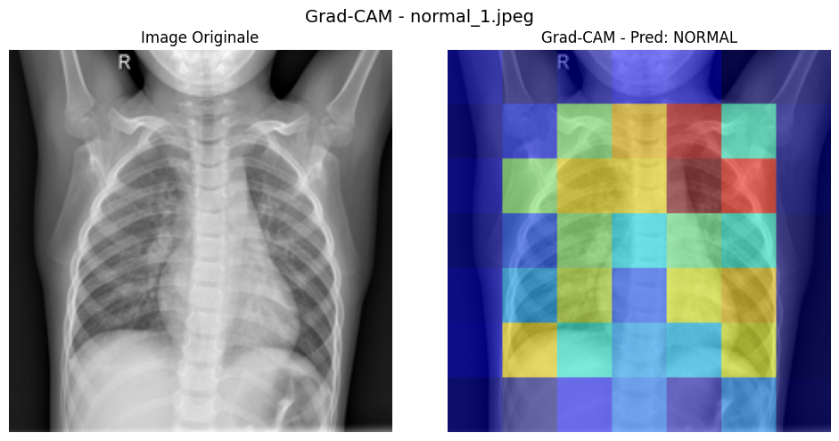
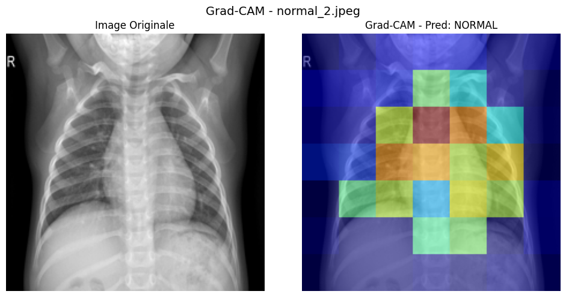
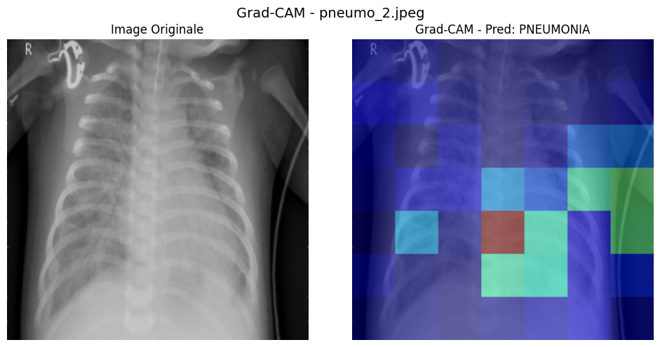
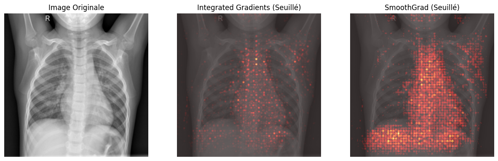
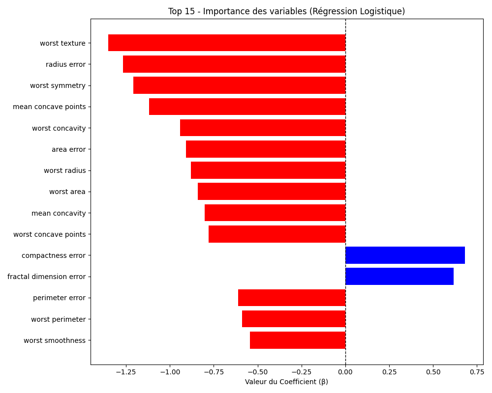
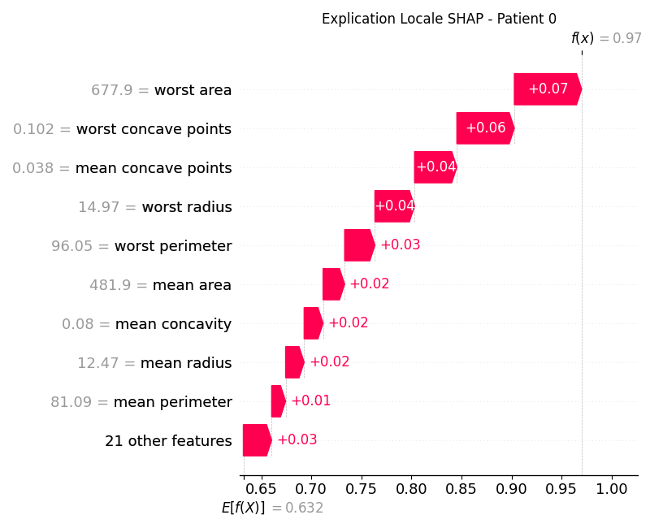
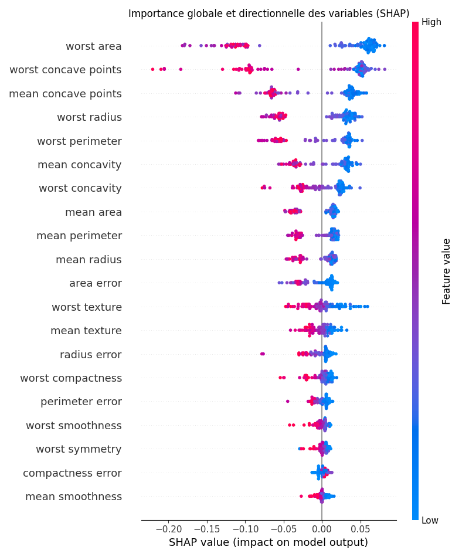

# TP6 – IA Explicable et Interprétable (XAI)

---

## Exercice 1 – Mise en place, Inférence et Grad-CAM

### Q1 – Installation et préparation

Dépendances installées via :
```bash
pip install captum transformers matplotlib Pillow
```

### Q2 – Téléchargement des images

Images radiographiques téléchargées : `normal_1.jpeg`, `normal_2.jpeg`, `pneumo_1.jpeg`, `pneumo_2.jpeg`.

### Q3 – Complétion de `01_gradcam.py`

Blancs complétés :
- `AutoModelForImageClassification.from_pretrained(model_name)` — chargement du modèle ResNet50 pré-entraîné pour la classification de pneumonie via HuggingFace.
- `time.time()` (×2) — enregistrement du temps de départ et de fin pour chronométrer l'inférence.
- `LayerGradCam(wrapped_model, target_layer)` — instanciation de Grad-CAM avec le modèle wrappé et la dernière couche convolutive du ResNet (`stages[-1].layers[-1]`).
- `layer_gradcam.attribute(input_tensor, target=predicted_class_idx)` — calcul des attributions Grad-CAM pour la classe prédite.

### Q4 – Exécution et analyse Grad-CAM

> **Capture d'écran** : voir `report/Terminal 01_gradcam.py normal_1.png`

```
=== normal_1.jpeg ===
Temps d'inférence : 0.1735 secondes
Classe prédite : NORMAL
Temps d'explicabilité (Grad-CAM) : 0.1092 secondes

=== normal_2.jpeg ===
Temps d'inférence : 0.1197 secondes
Classe prédite : NORMAL
Temps d'explicabilité (Grad-CAM) : 0.1052 secondes

=== pneumo_1.jpeg ===
Temps d'inférence : 0.0839 secondes
Classe prédite : NORMAL    <-- Faux négatif
Temps d'explicabilité (Grad-CAM) : 0.0799 secondes

=== pneumo_2.jpeg ===
Temps d'inférence : 0.0829 secondes
Classe prédite : PNEUMONIA
Temps d'explicabilité (Grad-CAM) : 0.0808 secondes
```

> Images Grad-CAM générées : `gradcam_normal_1.png`, `gradcam_normal_2.png`, `gradcam_pneumo_1.png`, `gradcam_pneumo_2.png`






**Analyse des erreurs de classification et effet Clever Hans :** Le modèle prédit correctement "NORMAL" pour les deux images saines, mais commet un **faux négatif** sur `pneumo_1.jpeg` (classée "NORMAL" au lieu de "PNEUMONIA"). Seule `pneumo_2.jpeg` est correctement classée "PNEUMONIA". En observant les cartes Grad-CAM, on constate que le modèle concentre son attention sur des zones en blocs grossiers qui ne correspondent pas toujours précisément aux zones d'opacité pulmonaire attendues. La carte Grad-CAM de `pneumo_1.jpeg` montre que le modèle se focalise sur la zone thoracique centrale et les épaules plutôt que sur les zones d'infiltration — c'est un cas d'**effet Clever Hans** : le modèle s'appuie sur des artefacts spatiaux (position du corps, marqueurs "R", bordures de l'image) plutôt que sur les véritables signes cliniques de pneumonie.

**Granularité :** Les zones colorées de Grad-CAM ressemblent à de **gros blocs flous**. Cette perte de résolution spatiale s'explique par l'architecture du ResNet : la dernière couche convolutive produit des feature maps de très petite résolution spatiale (typiquement 7×7 pour un ResNet50 avec entrée 224×224). Chaque pixel de cette feature map correspond à une large zone réceptive de l'image d'entrée. L'opération d'upsampling (interpolation) pour ramener la carte d'activation à la taille de l'image originale ne peut pas recréer les détails perdus — elle ne fait que lisser les blocs. C'est une limitation fondamentale des méthodes basées sur les feature maps de couches profondes.

---

## Exercice 2 – Integrated Gradients et SmoothGrad

### Q1 – Complétion de `02_ig.py`

Blancs complétés :
- `IntegratedGradients(wrapped_model)` — instanciation de la méthode IG sur le modèle wrappé.
- `torch.zeros_like(input_tensor)` — création de la baseline (image noire de même forme que l'entrée), servant de point de référence neutre pour le calcul des gradients intégrés.
- `ig.attribute(...)` avec `n_steps=50, internal_batch_size=2` — calcul des attributions IG en 50 étapes d'interpolation entre la baseline et l'image, avec batching interne pour protéger la VRAM.
- `NoiseTunnel(ig)` — enveloppement de l'instance IG dans un NoiseTunnel pour appliquer SmoothGrad.
- `stdevs=0.1` — écart-type du bruit gaussien ajouté, adapté à la normalisation de l'image.
- `internal_batch_size=2` — limitation de la mémoire pour SmoothGrad.

### Q2 – Exécution et analyse IG / SmoothGrad

> **Capture d'écran** : voir `report/Terminal 02_ig.png`

```
Analyse fine au pixel sur : normal_1.jpeg
Temps IG pur : 8.3181s
Temps SmoothGrad (IG x 100) : 1072.9964s (~17 minutes 53 secondes)
```

> Image comparative générée : `ig_smooth_normal_1.png`



**Temps d'exécution et faisabilité temps réel :** L'inférence simple prend ~0.17s, tandis que SmoothGrad (IG × 100 échantillons × 50 steps) a pris **1073 secondes (~18 minutes)** sur CPU. Le ratio est de **~6300×** plus lent que l'inférence. Il n'est donc absolument **pas technologiquement possible** de générer cette explication de manière synchrone (en temps réel) lors du premier clic d'analyse d'un médecin.

**Architecture logicielle proposée :** Utiliser une architecture **asynchrone avec file d'attente de messages** (type RabbitMQ/Celery) : l'inférence rapide est retournée immédiatement au médecin, tandis qu'un worker en arrière-plan calcule l'explication XAI et la pousse au frontend via WebSocket dès qu'elle est prête, ou la stocke pour consultation ultérieure.

**Avantage des cartes signées (IG) vs ReLU (Grad-CAM) :** Integrated Gradients produit des attributions qui peuvent être **positives ou négatives**, contrairement à Grad-CAM qui applique un filtre ReLU éliminant toutes les contributions négatives. L'avantage mathématique est de pouvoir distinguer les pixels qui **contribuent positivement** à la prédiction (poussent vers la classe prédite) de ceux qui **s'y opposent** (poussent vers l'autre classe). Cela donne une explication plus complète et nuancée : on sait non seulement ce qui active la décision, mais aussi ce qui la freine. De plus, IG satisfait l'axiome de complétude (la somme des attributions égale la différence entre la sortie sur l'image et la sortie sur la baseline), ce que Grad-CAM ne garantit pas.

---

## Exercice 3 – Modélisation Intrinsèquement Interprétable (Glass-box) sur Données Tabulaires

### Q1 – Installation

```bash
pip install scikit-learn pandas
```

### Q2 – Complétion de `03_glassbox.py`

Blancs complétés :
- `scaler.fit_transform(X_train)` — adaptation du StandardScaler sur les données d'entraînement puis transformation (normalisation z-score). Crucial pour que les coefficients de la régression logistique soient comparables entre eux.
- `model.fit(X_train_scaled, y_train)` — entraînement de la régression logistique avec pénalité L2.
- `model.coef_[0]` — extraction du vecteur de coefficients β appris. `coef_` est un tableau 2D (n_classes × n_features), donc `[0]` pour extraire la première (unique en binaire) ligne.

### Q3 – Exécution et analyse Glass-box

> **Capture d'écran** : voir `report/Terminal 03_glassbox.py .png`

```
Accuracy de la Régression Logistique : 0.9737
```

> Image générée : `glassbox_coefficients.png`



**Caractéristique la plus importante vers "Maligne" :** En observant le graphique, la caractéristique ayant le coefficient négatif le plus fort (en valeur absolue) est **`worst texture`** (β ≈ -1.35), suivie de **`radius error`** (β ≈ -1.30) et **`worst symmetry`** (β ≈ -1.20). Ces features poussent le plus la prédiction vers la classe 0 (Maligne). Un coefficient négatif fort signifie qu'une augmentation de cette variable (après normalisation) diminue fortement la probabilité de la classe 1 (Bénigne), donc augmente la probabilité de Maligne. On note également que **`mean concave points`** a un coefficient très négatif (~-1.15), confirmant l'importance clinique des points de concavité dans la caractérisation des tumeurs malignes.

**Avantage de l'interprétabilité intrinsèque :** L'avantage d'un modèle directement interprétable (glass-box) comme la régression logistique est que l'explication est **exacte et garantie par construction** — les coefficients β sont les poids réels utilisés par le modèle pour sa décision, contrairement aux méthodes post-hoc (Grad-CAM, SHAP) qui produisent des approximations de l'importance des features et peuvent être sensibles aux hyperparamètres de la méthode d'explication elle-même.

---

## Exercice 4 – Explicabilité Post-Hoc avec SHAP sur un Modèle Complexe

### Q1 – Installation

```bash
pip install shap
```

### Q2 – Complétion de `04_shap.py`

Blancs complétés :
- `model.fit(X_train, y_train)` — entraînement du Random Forest (pas de normalisation nécessaire pour les arbres).
- `shap.TreeExplainer(model)` — instanciation de l'explainer SHAP optimisé pour les modèles à base d'arbres. TreeExplainer utilise un algorithme exact en O(TLD²) au lieu de l'approximation par échantillonnage.
- `explainer(X_test)` — calcul des valeurs SHAP pour tout le jeu de test. L'objet explainer est callable et retourne un objet Explanation contenant les valeurs SHAP, les données de base et les valeurs attendues.

### Q3 – Exécution et analyse SHAP

> **Capture d'écran** : voir `report/Terminal 04_shap.py.png`

```
Accuracy du Random Forest : 0.9649
```

> Images générées : `shap_waterfall.png`, `shap_summary.png`




**Explicabilité Globale (Summary Plot) :** Les 3 variables les plus importantes identifiées par le Random Forest via SHAP sont **`worst area`**, **`worst concave points`** et **`mean concave points`**. On retrouve `mean concave points` dans le top des deux modèles (également très important en régression logistique avec β ≈ -1.15). Les variables liées à la concavité (`concave points`, `concavity`) et à la taille (`area`, `radius`, `perimeter`) dominent dans les deux cas. Cette convergence entre un modèle linéaire (glass-box) et un modèle non-linéaire complexe (black-box) confirme la **robustesse de ces biomarqueurs cliniques** : ces caractéristiques morphologiques des cellules sont réellement discriminantes pour distinguer les tumeurs bénignes des malignes, indépendamment de l'algorithme utilisé. Cela renforce la confiance dans ces features pour un déploiement clinique.

**Explicabilité Locale (Waterfall Plot - Patient 0) :** Le Waterfall Plot du patient 0 montre la prédiction finale f(x) = 0.97 (très probablement Bénigne), partant de la valeur de base E[f(X)] = 0.632. La caractéristique ayant le plus contribué est **`worst area`** (valeur = 677.9, SHAP = +0.07), suivie de **`worst concave points`** (valeur = 0.102, SHAP = +0.06) et **`mean concave points`** (valeur = 0.038, SHAP = +0.04). Toutes les contributions sont positives pour ce patient, ce qui pousse fortement vers la classe Bénigne : les faibles valeurs de concavité et d'aire indiquent une tumeur aux contours réguliers et de petite taille, caractéristiques d'une tumeur bénigne.

---

## Vérification du dépôt

Le dossier `TP6/` contient :
- Les 4 scripts Python complétés : `01_gradcam.py`, `02_ig.py`, `03_glassbox.py`, `04_shap.py`.
- Les images radiographiques de test : `normal_1.jpeg`, `normal_2.jpeg`, `pneumo_1.jpeg`, `pneumo_2.jpeg`.
- Les images de visualisation générées : `gradcam_*.png`, `ig_smooth_*.png`, `glassbox_coefficients.png`, `shap_waterfall.png`, `shap_summary.png`.
- Le fichier `rapport.md`.
